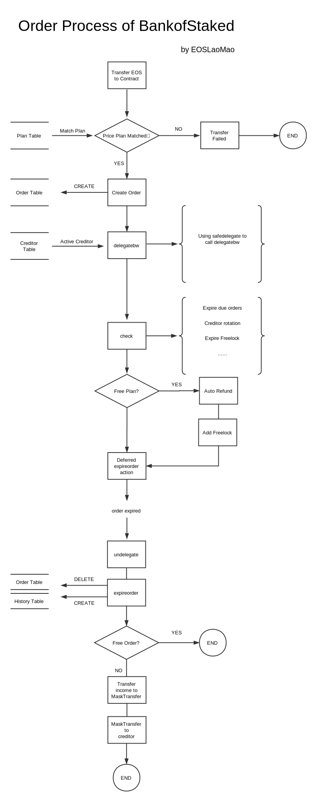

<p align="center">
  
</p>

<div align="center">
	<h1>Bank of Staked</h1>
	<h2>a self-serve CPU&NET Vending Machine</h2>
</div>

<a href="./README-CN.md">中文版介绍</a>

### About
Bank of Staked is an EOS smart contract aiming to provide cheap CPU&NET lease to both EOS users and developers. This contract is build by `EOSLaoMao Team`.

### Design

The UX Bank of Staked wants to achieve is that any account could get CPU&NET delegated automatically through a simple transfer, no more action needed. And the undelegate process will also be triggered automatically.

The main logic of Bank of Staked are realized through these three tables:

#### 1. Plan Table

Plan table holds all avialible plans user can choose, main fields are:

```
price			asset; //plan price
cpu			asset; // delegated cpu this plan offers.
net			asset; // delegated net this plan offers.
duration		unit64; //the period of time service gonna last, in minutes.
is_free			uint64; //free plan or not, if is_free is 1, order will be auto refunded.
...
```

#### 2. Creditor Table

`Creditors` are the real ones who delegate&undelegate. When a valid transfer happens, the contract will try to find `is_active` creditor to do an auto delegation using that creditor account.

```
account			account_name;
is_active		uint64;
...
```

`is_active` indicates if this creditor is ready to delegate or not.

in production, you should always have creditors shifting like 3 days in a roll, so that non-active creditors have time to get their undelegated token back.

#### 3. Order Table

Order table consists of active order records, by active, we mean these orders are not expired.

```
buyer				account_name;
creditor			account_name;
beneficiary			account_name;
cpu_staked			asset;
net_staked			asset;
expire_at			uint64;
...
```

`buyer` is the account who did the actual transfer in the first place, if any refund happens, token will be refunded to `buyer` account also.

`beneficiary` is the actual account who get cpu and net delegated. `buyer` can specify this account in transfer memo if he/she like.

`creditor` is the account who did delegation.

`cpu_staked` and `net_staked` is cpu&net delegated in this order.

`expire_at` is when this order will expire. After order expired, order record will be deleted from Order Table.


There are also several other tables facilitating this contract. such as,

`freelock` table, used to lock free plan for each account for 24 hours.

`history` table, used to store meta data of deleted expired order.

`blacklist`, used to blacklist certain account from using `bankofstaked` contract.





# Bank of Staked on Mainnet

### How to use it

We have deployed it on Mainnet: 

https://www.myeoskit.com/#/tx/bankofstaked


#### 1.Check available price plan

Query `plan` table to get available plans:


```
cleos -u https://api1.eosasia.one get table bankofstaked bankofstaked plan

{
  "rows": [{
      "id": 0,
      "price": "0.1000 EOS",
      "is_free": "1",
      "cpu": "1.0000 EOS",
      "net": "0.0000 EOS",
      "duration": 60,
      "created_at": 1535965927,
      "updated_at": 1535965927
    },
  ],
  "more": false
}
```

`price` indicates the EOS you should transfer to `bankofstaked` to get certain `cpu` and `net` for `duration` minutes.

`is_free` means if you can get a refund or not(is refund applied, it will happend immediately!!)

Currently we only provide 1 FREE plan: `0.1 EOS` for `60 min of 1 EOS CPU` staked, you will get a 0.1 EOS refund immediately after you transfer.

Will add more plans ASAP.


#### 2.Transfer EOS and get delegated!


Currently, you can transfer `0.1 EOS` to `bankofstaked` to get `1 EOS` staked for `cpu` for `60 minutes`. 

NOTE: `bankofstaked` will automatically return the token you transfered back to you immediately.


```
cleos -u https://api1.eosasia.one transfer YOUR_ACCOUNT bankofstaked "0.1 EOS" -p YOUR_ACCOUNT@active
```

After transfering token, you will be delegated `1 EOS of CPU` to you , after 60 minutes, it will undelegate automatically using deferred transaction.


---

if you want to contribute your EOS to creditor fund(only delegate, no transfer needed), or if you are a BP who are willing to help users and developers, please contact us at: contact@eoslaomao.com

built with love by EOSLaoMao Team. :)

Icon made by Freepik from www.flaticon.com, special thanks~
