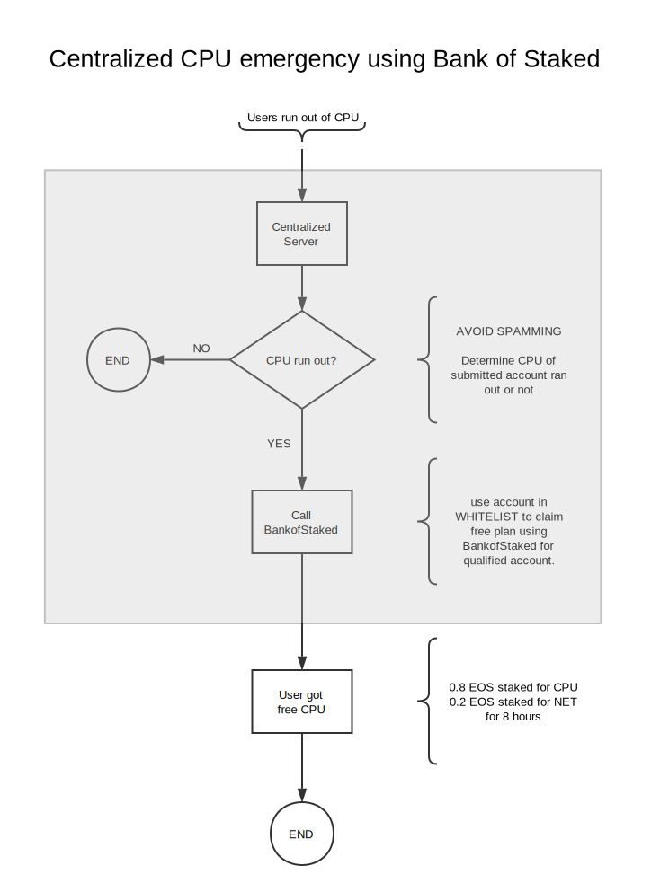
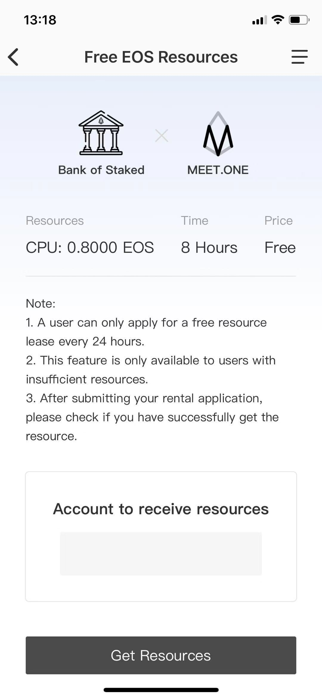
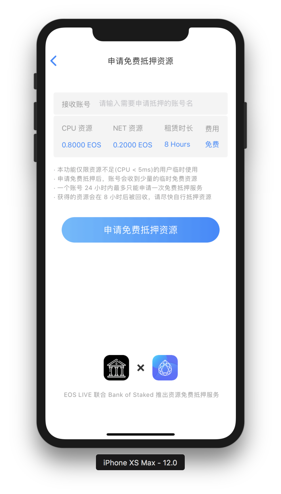

# CPU Emergency Document

BankofStaked provides a mechanism called `whitelist` to enable centralized CPU emergency service. MEET.ONE and EOS.LIVE wallet have already developed CPU emergency services using this feature.

This document is a guide to develop a centralized CPU emergency service for wallets/tools.

# How it works

Here is a diagram showing how it works:

The grey part of the diagram should be provided by wallets/tools who wants to provide  centralized CPU emergency service.

details of the requirements are:

1. a frontend for users in your wallet/tool for users to submit accounts.
2. an API to submit account with proper anti-spamming setup.
3. an EOS account provided to `bankofstaked` which will be added to `whitelist` with a proper `capacity`. you can reach out to contact@eoslaomao.com for details.

for part one, here are frontend examples provided by MEET.ONE and EOS.LIVE:

